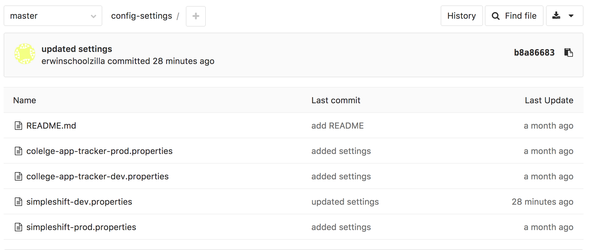
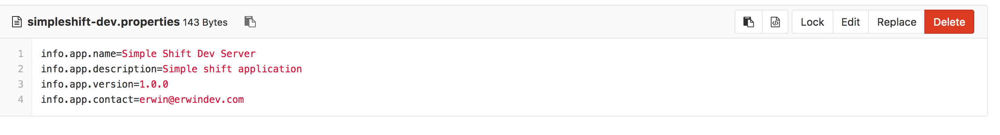

[](https://travis-ci.org/erwindev/config-server)

# College App Tracker Config Server

## Summary
The College App Tracker Config Server is an application that will allow other applications to centralize the location their configuration settings.  Currently, this application will host configuration settings in a GIT repository.  One advantage of hosting the config server in a GIT repository is the ability to capture and see the changes of your config settings overtime.  It can also give your an application the ability to change the setting without having to restart the application.


## Prequisites
Because the College App Tracker Config Server uses a GIT repository to store the config settings, set up a GIT repo that will contain all the config.  The image below is how I have setup my config-settings repo.



   
   
## Run the application

Before you can run this application, you will need to set some environment variables.  Feel free to copy the `env.current.template` into another file like `env.current` file and update the environment variables in that new file before sourcing it.  
  
```
$ source env.current
```  

Compile and create the executable jar file.

```
$ gradle assemble
```

Run the application.

```
$ java -jar build/libs/config-server.jar

```

## Access the config settings

```
$ curl http://localhost:9000/simpleshift/dev

```    

## Docker build and push
```
$ docker build -t ealberto/config-server .
$ docker push ealberto/config-server
```

## Deploying in OpenShift via Minishift

Redhat provides are real easy way to run OpenShift locally using Minishift.  Minishift is a single-node OpenShift cluster running inside a virtual machine.

To install Minishift, follow the[directions](https://docs.openshift.org/latest/minishift/getting-started/installing.html)in this installation guide.  As a note, I'm running these examples in MacOSX but I use VirtualBox as my VM driver.  

```
$ minishift start --vm-driver=virtualbox

```

### Accessing to the OpenShift CLI (oc)
```
$ minishift oc-env
$ eval $(minishift oc-env)

```

### Deploying the application to OpenShift
To deploy the application, you will need to set a few environment variables.  Please copy `openshift.env.template` into another `openshift.env` and update the variables accordingly.
Please note that we are using a Docker image (ealberto/config-server) hosted in Dockerhub to create the application.  So, before you can run the following command, please make sure you have built your docker image.
```
$ oc new-app ealberto/config-server --env-file=openshift.env
$ oc expose svc/config-server

```

### Access the config settings
```
$ curl http://config-server-myproject.192.168.99.101.nip.io/simpleshift/dev
```

### Deleting the application in OpenShift
```
$ oc delete all --selector app=config-server
```